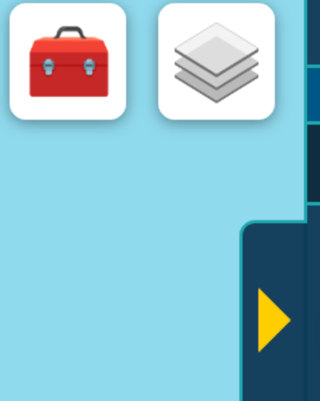
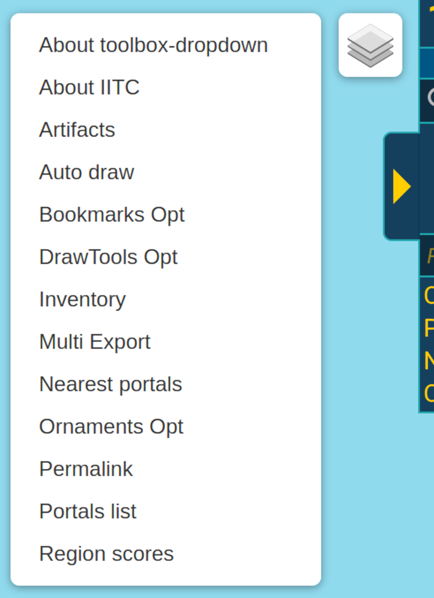
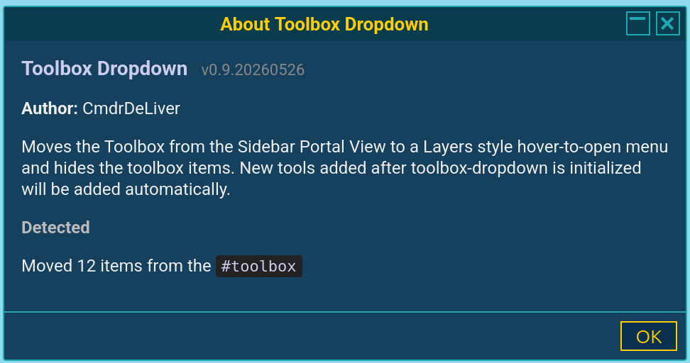

# Toolbox Dropdown

Moves the Toolbox from the Sidebar Portal View to a Layers style hover-to-open menu and hides the toolbox items. New tools added after toolbox-dropdown is initialized will be added automatically.

A small toolbox button appears to the left of the layers control on the map. Hover it to expand a vertical list of every plugin entry that would normally appear in IITC's sidebar toolbox strip. Click one to open it; the menu collapses automatically.

## Screenshots

**Closed — toolbox icon sits to the left of the layers control, top-right of the map:**

**Open — hover the toolbox to expand the plugin list:**

**About dialog — opened from the synthetic "About toolbox-dropdown" entry at the top of the menu:**

## Behavior

- **Source:** direct `<a>` children of `#toolbox_component` (the rendered toolbox the user actually clicks on).
- **Placement:** an `L.Control` at `topright`, then CSS-pulled out of the right-column grid and absolutely positioned 46px from the right edge so it sits flush to the LEFT of the layers control at the same vertical position. Keeps it clear of the sidebar toggle below.
- **Look & feel:** reuses Leaflet's own `.leaflet-control-layers`, `.leaflet-control-layers-list`, and `.leaflet-control-layers-expanded` classes for the white box / border-radius / shadow / collapse-on-mouseleave. The toggle has its own `.tbd-control-toggle` class (no inherited layers-sprite background) and uses a 🧰 unicode glyph.
- **Order:** alphabetical, with `About toolbox-dropdown` and then `About IITC` pinned to the top.
- **Activation:** one click. Items carrying a real anchor invoke that anchor's `click()` (so plugins' `onclick="…"` handlers run untouched); the synthetic `About toolbox-dropdown` item carries a `handler:fn` instead and calls our own About dialog. Either way the menu collapses on click.
- **Hidden, not removed:** the original `#toolbox_component` strip is hidden (`display:none !important` via a `.tbd-hidden` class). Anchors remain in the DOM, so anything that queries them for click handlers / introspection still sees them.
- **Asynchronous registration:** a `MutationObserver` on `#toolbox_component` (childList only, filtered to anchor add/remove) rebuilds the menu when plugins register their toolbox link after this plugin's `setup()` runs. Rebuilds are debounced 100ms and idempotent (a signature check skips DOM work entirely when the anchor set hasn't changed since the last build).
- **Map readiness:** setup polls every 100ms for `window.map` + `L.Control` to become available (up to 5s), then adds the control. Required because `L` isn't defined until IITC finishes initializing Leaflet, and some plugins load before that point.

## Caveats

- Anchors with no readable `.text()` (rare — some plugins use unicode-icon-only links that may render empty) are skipped, since they can't be uniquely labelled in a menu row.
- Plugins that re-style their own toolbox anchor with custom CSS won't show that styling in the dropdown — the dropdown picks up the `.text()` and `title=""` attribute only.
- The Leaflet layers control itself is a separate widget; this plugin doesn't touch it.
- The 46px left offset assumes a collapsed layers control width of 36px + 10px gap. If a future IITC build ships a wider layers toggle, the offset becomes wrong and the toolbox would overlap the layers icon.

## Install

[**Install toolbox-dropdown**](https://raw.githubusercontent.com/cmdrdeliver/iitc-plugins/main/toolbox-dropdown/toolbox-dropdown.user.js)

Requires IITC-CE and a userscript manager (Tampermonkey or Violentmonkey).
